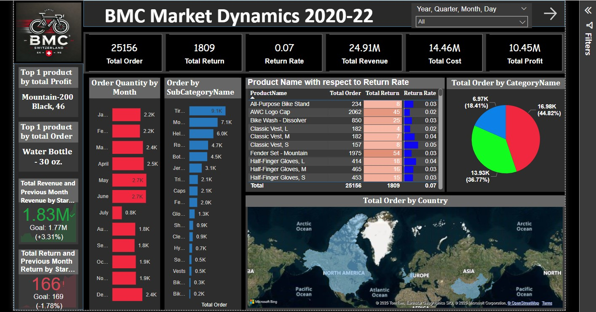
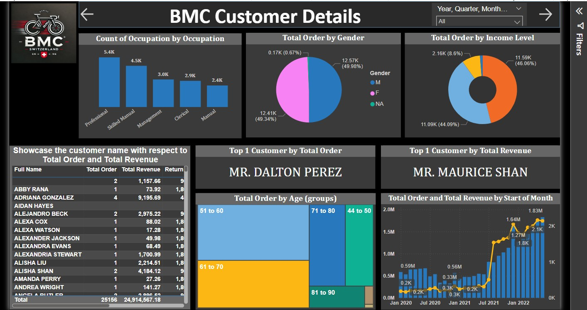
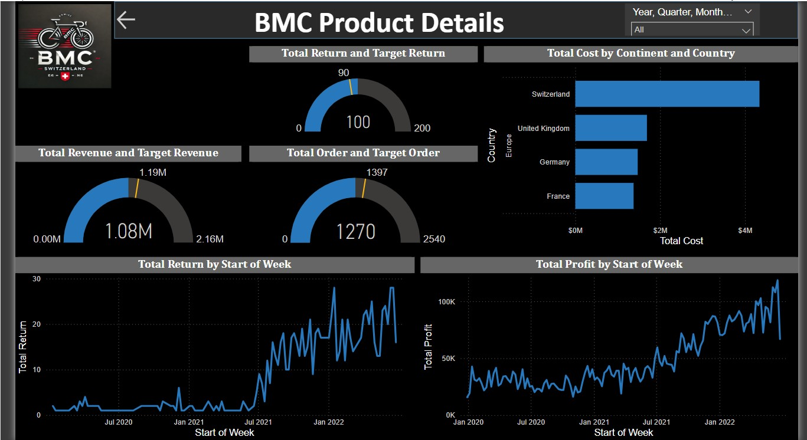

# BMC Sales Dashboard (2020-22)

This Power BI dashboard provides detailed insights into BMC's sales performance from 2020 to 2022. It visualizes key metrics such as total revenue, profit, return rates, and top-performing products, offering a comprehensive view of the company's operations.

## Features

- **Comprehensive Overview**:
  - Total Orders, Returns, Revenue, Profit, and Return Rate.
- **Top-Performing Products**:
  - Highlights the most profitable and highest-ordered products.
- **Monthly Trends**:
  - Displays order quantity trends month by month.
- **Return Rate Analysis**:
  - Shows return rates by product to identify areas for improvement.
- **Regional Sales Insights**:
  - Visualizes total orders by country using an interactive map.
- **Dynamic Filtering**:
  - Filters by Year, Quarter, Month, and Day for flexible analysis.

## Preview

_This is a snapshot of the Power BI dashboard showcasing key metrics and visualizations._

## How to Use

1. Download the `.pbix` file from this repository.
2. Open the file in Power BI Desktop.
3. Use the interactive filters and visualizations to explore the data and derive insights.

## Technologies Used

- **Power BI**: For data visualization and dashboard creation.
- **Data Sources**: Sample data for BMC sales records from 2020-2022.

## Project Highlights

This project demonstrates the use of Power BI to:
- Build dynamic dashboards with interactive visualizations.
- Analyze and present sales performance data for business insights.
- Identify trends, opportunities, and areas for optimization.

Feel free to explore and share feedback! 😊

